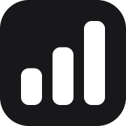

<p align="center"></p>

# ASO Atlas MCP server

[ASO Atlas](https://asoatlas.com) is an App Store Optimization tool for App Store and Google Play apps: keyword research with Apple-reported search popularity and a difficulty score, daily rank tracking in 59 storefronts, competitor keyword gaps, a metadata optimizer and your own App Store Connect performance.

This repository holds the public manifests for its hosted MCP server, so any MCP client can research keywords and act on your ASO Atlas account mid-conversation.

- **Server URL:** `https://asoatlas.com/mcp` (Streamable HTTP)
- **Auth:** OAuth 2.1 with PKCE and dynamic client registration, or a personal access token for headless agents
- **Docs:** https://asoatlas.com/docs/connect-your-ai
- **Requires:** an ASO Atlas account with an active subscription ($9/month, unlimited apps and keywords)

## Install

### Claude

Claude.ai (web or desktop): Settings → Connectors → Add custom connector → paste the server URL and approve the consent screen.

Claude Code:

```bash
claude mcp add --transport http asoatlas https://asoatlas.com/mcp
```

Or install this repository as a plugin, which adds the server together with a skill that teaches Claude how to read popularity and difficulty:

```bash
claude plugin marketplace add asoatlas/mcp
claude plugin install aso-atlas@asoatlas-mcp
```

### Cursor

[Add to Cursor](cursor://anysphere.cursor-deeplink/mcp/install?name=asoatlas&config=eyJ1cmwiOiJodHRwczovL2Fzb2F0bGFzLmNvbS9tY3AifQ==), or in `~/.cursor/mcp.json`:

```json
{ "mcpServers": { "asoatlas": { "url": "https://asoatlas.com/mcp" } } }
```

### VS Code

```bash
code --add-mcp '{"name":"asoatlas","type":"http","url":"https://asoatlas.com/mcp"}'
```

### Codex

Install this repository as a plugin, which adds the server together with the same skill:

```bash
codex plugin marketplace add asoatlas/mcp
codex plugin add aso-atlas@asoatlas
codex mcp login asoatlas
```

Or only the server, in `~/.codex/config.toml`:

```toml
[mcp_servers.asoatlas]
url = "https://asoatlas.com/mcp"
```

then `codex mcp login asoatlas` to approve the consent screen.

### ChatGPT

Settings → Security and login → turn on Developer mode, then Plugins → + → paste the server URL. The OAuth prompt signs you in to ASO Atlas.

### Hermes Agent, containers and other headless clients

The OAuth callback cannot reach a client that runs on a server, so create a personal access token under **Settings → Connect your AI** on asoatlas.com and send it as a header:

```yaml
mcp_servers:
  asoatlas:
    url: https://asoatlas.com/mcp
    headers:
      Authorization: Bearer YOUR_TOKEN
```

Any other client that speaks MCP over HTTP works the same way: give it the URL, then either complete the OAuth prompt or configure the bearer header.

## Tools

Everything is scoped to the signed-in user's own account. Read tools never change anything; write tools change the ASO Atlas account only, never the App Store listing itself.

| Tool | Kind | What it does |
|---|---|---|
| `list_tracked_apps` | read | The apps you track, with the ids the other tools take |
| `get_dashboard` | read | Per-app top 10 / top 50 counts, visibility trend, biggest moves |
| `get_app` | read | One app in depth: keywords with rank, popularity, difficulty; competitors; keyword gap |
| `get_app_optimizer` | read | Metadata analysis for one storefront: coverage, missing terms, character budgets |
| `get_app_performance` | read | App Store Connect digest: funnel, monetization, health, territories |
| `get_performance_series` | read | Daily history of one App Store Connect metric, optionally split by dimension |
| `research_keywords` | read | Popularity, difficulty and result count for up to 50 terms in a storefront |
| `app_ranking_keywords` | read | Reverse lookup: what any App Store app ranks for |
| `keyword_suggestions` | read | Autocomplete ideas for a seed term |
| `list_keyword_lists` / `get_keyword_list` | read | Saved research collections |
| `track_app` / `untrack_app` | write | Start or stop tracking an app |
| `add_keywords` / `remove_keyword` | write | Track or drop keywords per storefront |
| `add_competitor` / `remove_competitor` | write | Manage the competitors behind the keyword gap |
| `change_app_market` | write | Move an app to another storefront |
| `refresh_app` | write | Queue a fresh rank, rating and review check |
| `save_metadata_draft` | write | Save a title / subtitle / keyword-field draft for the optimizer |
| `create_keyword_list` / `add_keyword_to_list` / `remove_keyword_from_list` | write | Manage keyword lists |

Every tool carries `readOnlyHint`, `destructiveHint` and `openWorldHint` annotations; destructive tools delete ranking history and say so in their description.

## What is in this repository

- `server.json`: the entry published to the [official MCP Registry](https://registry.modelcontextprotocol.io) as `com.asoatlas/mcp`
- `.claude-plugin/plugin.json` + `.claude-plugin/marketplace.json` + `.mcp.json` + `skills/aso-atlas/SKILL.md`: a Claude Code plugin bundling the server with a skill
- `plugin.json` + `mcp.json`: the same as an [Agent Plugin](https://agent-plugins.org) for Codex (OpenAI settings under `extensions.com.openai`), Cursor and compatible clients; `.agents/plugins/marketplace.json` makes the repository a Codex marketplace
- `SETUP.md`: the connection walkthrough a client can follow after install

The server itself is part of the ASO Atlas web application and is not open source. The manifests and skill here are MIT licensed.

## Privacy Policy

The server only ever reads and writes the signed-in user's own ASO Atlas data. Privacy policy: https://asoatlas.com/privacy. Terms: https://asoatlas.com/terms. Support: support@asoatlas.com.
